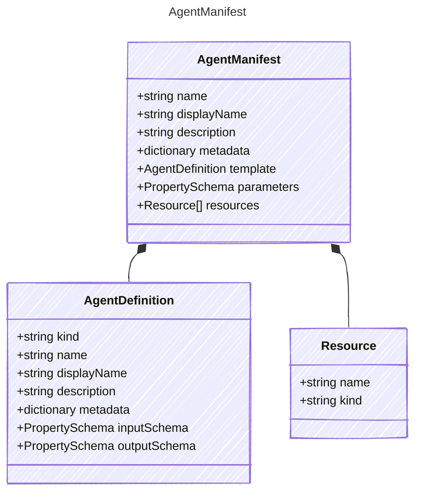

# AgentManifest

The following represents a manifest that can be used to create agents dynamically.
It includes parameters that can be used to configure the agent&#39;s behavior.
These parameters include values that can be used as publisher parameters that can
be used to describe additional variables that have been tested and are known to work.

Variables described here are then used to project into a prompt agent that can be executed.
Once parameters are provided, these can be referenced in the manifest using the following notation:

`{{myParameter}}`

This allows for dynamic configuration of the agent based on the provided parameters.
(This notation is used elsewhere, but only the `param` scope is supported here)

## Class Diagram



## Yaml Example

```yaml
name: basic-prompt
displayName: My Basic Prompt
description: A basic prompt that uses the GPT-3 chat API to answer questions
metadata:
  authors:
    - sethjuarez
    - jietong
  tags:
    - example
    - prompt
template:
  kind: prompt
  model: "{{model_name}}"
  instructions: You are a poet named {{agent_name}}. Rhyme all your responses.
parameters:
  strict: true
  properties:
    - name: model_name
      kind: string
      value: gpt-4o
    - name: agent_name
      kind: string
      value: Research Agent
resources:
  gptModelDeployment:
    kind: model
    id: gpt-4o
  webSearchInstance:
    kind: tool
    id: web-search
    options:
      apiKey: my-api-key

```

## Properties

| Name | Type | Description |
| ---- | ---- | ----------- |
| name | string | Name of the manifest  |
| displayName | string | Human-readable name of the manifest  |
| description | string | Description of the agent&#39;s capabilities and purpose  |
| metadata | dictionary | Additional metadata including authors, tags, and other arbitrary properties  |
| template | [AgentDefinition](AgentDefinition.md) | The agent that this manifest is based on (Related Types: [PromptAgent](PromptAgent.md), [Workflow](Workflow.md), [ContainerAgent](ContainerAgent.md)) |
| parameters | [PropertySchema](PropertySchema.md) | Parameters for configuring the agent&#39;s behavior and execution  |
| resources | [Resource[]](Resource.md) | Resources required by the agent, such as models or tools (Related Types: [ModelResource](ModelResource.md), [ToolResource](ToolResource.md)) |

## Composed Types

The following types are composed within `AgentManifest`:

- [AgentDefinition](AgentDefinition.md)
- [Resource](Resource.md)
