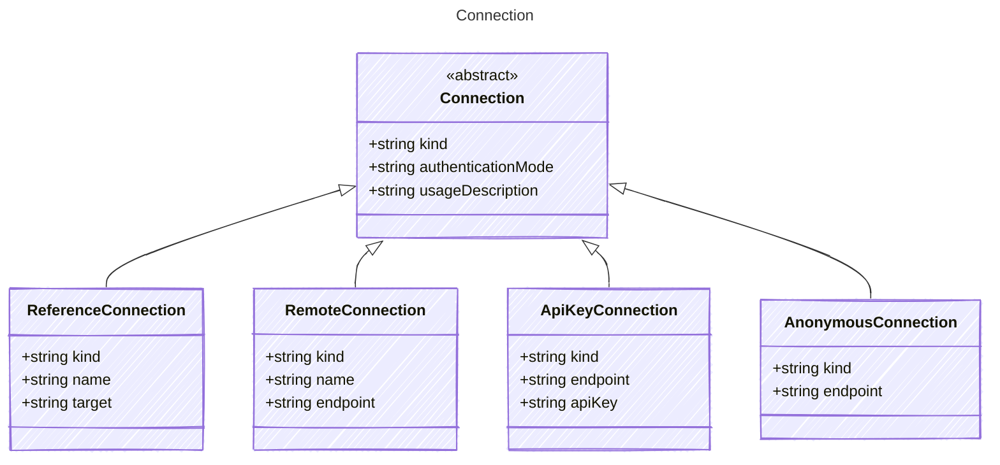

# Connection

Connection configuration for AI agents.
`provider`, `kind`, and `endpoint` are required properties here,
but this section can accept additional via options.

## Class Diagram



## Yaml Example

```yaml
kind: reference
authenticationMode: system
usageDescription: This will allow the agent to respond to an email on your behalf

```

## Properties

| Name | Type | Description |
| ---- | ---- | ----------- |
| kind | string | The Authentication kind for the AI service (e.g., &#39;key&#39; for API key, &#39;oauth&#39; for OAuth tokens)  |
| authenticationMode | string | The authority level for the connection, indicating under whose authority the connection is made (e.g., &#39;user&#39;, &#39;agent&#39;, &#39;system&#39;)  |
| usageDescription | string | The usage description for the connection, providing context on how this connection will be used  |

## Child Types

The following types extend `Connection`:

- [ReferenceConnection](ReferenceConnection.md)
- [RemoteConnection](RemoteConnection.md)
- [ApiKeyConnection](ApiKeyConnection.md)
- [AnonymousConnection](AnonymousConnection.md)
