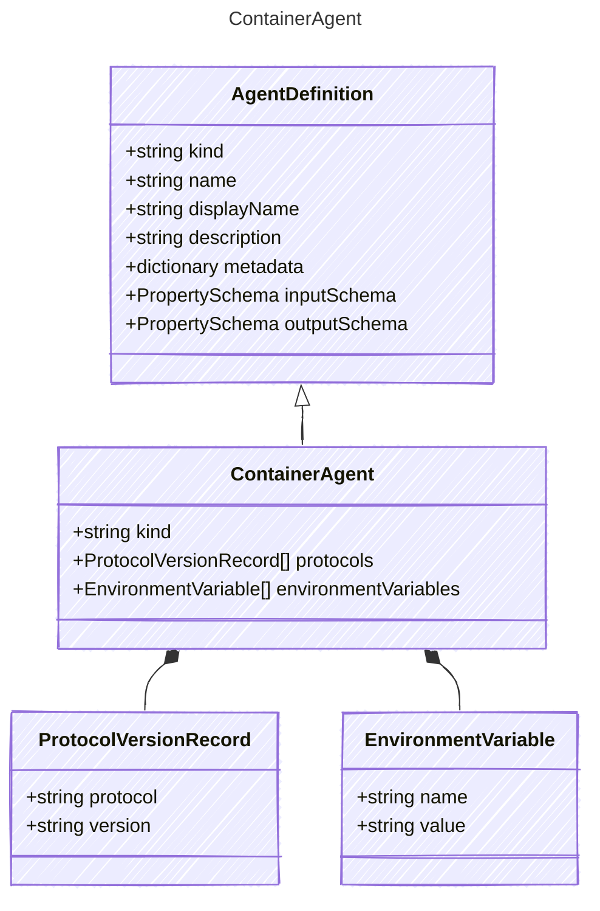

# ContainerAgent

This represents a container based agent hosted by the provider/publisher.
The intent is to represent a container application that the user wants to run
in a hosted environment that the provider manages.

## Class Diagram



## Yaml Example

```yaml
kind: hosted
protocols:
  - protocol: responses
    version: v0.1.1
environmentVariables:
  - name: MY_ENV_VAR
    value: my-value

```

## Properties

| Name | Type | Description |
| ---- | ---- | ----------- |
| kind | string | Type of agent, e.g., &#39;hosted&#39;  |
| protocols | [ProtocolVersionRecord[]](ProtocolVersionRecord.md) | Protocol used by the containerized agent  |
| environmentVariables | [EnvironmentVariable[]](EnvironmentVariable.md) | Environment variables to set in the container  |

## Composed Types

The following types are composed within `ContainerAgent`:

- [ProtocolVersionRecord](ProtocolVersionRecord.md)
- [EnvironmentVariable](EnvironmentVariable.md)
