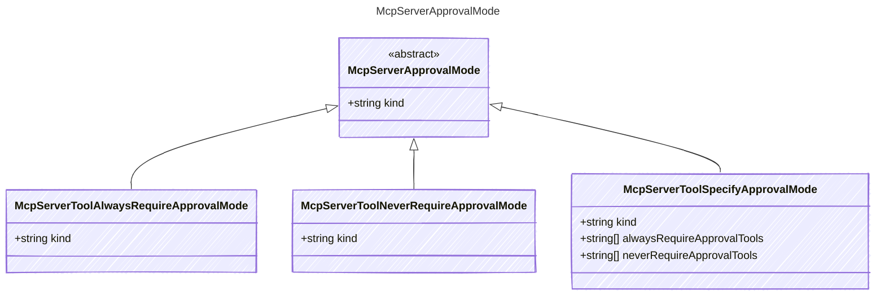

# McpServerApprovalMode

The approval mode for MCP server tools.

## Class Diagram



## Yaml Example

```yaml
kind: never

```

## Properties

| Name | Type | Description |
| ---- | ---- | ----------- |
| kind | string | The kind identifier for string approval modes  |

## Child Types

The following types extend `McpServerApprovalMode`:

- [McpServerToolAlwaysRequireApprovalMode](McpServerToolAlwaysRequireApprovalMode.md)
- [McpServerToolNeverRequireApprovalMode](McpServerToolNeverRequireApprovalMode.md)
- [McpServerToolSpecifyApprovalMode](McpServerToolSpecifyApprovalMode.md)

## Alternate Constructions

The following alternate constructions are available for `McpServerApprovalMode`.
These allow for simplified creation of instances using a single property.

### string kind

Mcp Approval Mode

The following simplified representation can be used:

```yaml
kind: "example"

```

This is equivalent to the full representation:

```yaml
kind:
  kind: "example"

```
