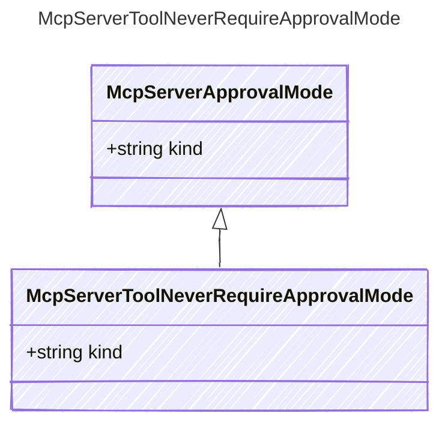

# McpServerToolNeverRequireApprovalMode

## Class Diagram



## Yaml Example

```yaml
kind: never

```

## Properties

| Name | Type | Description |
| ---- | ---- | ----------- |
| kind | string | The kind identifier for never approval mode  |
