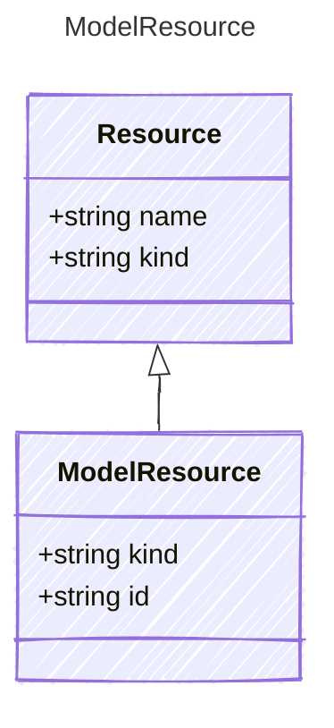

# ModelResource

Represents a model resource required by the agent

## Class Diagram



## Yaml Example

```yaml
kind: model
id: gpt-4o

```

## Properties

| Name | Type | Description |
| ---- | ---- | ----------- |
| kind | string | The kind identifier for model resources  |
| id | string | The unique identifier of the model resource  |
