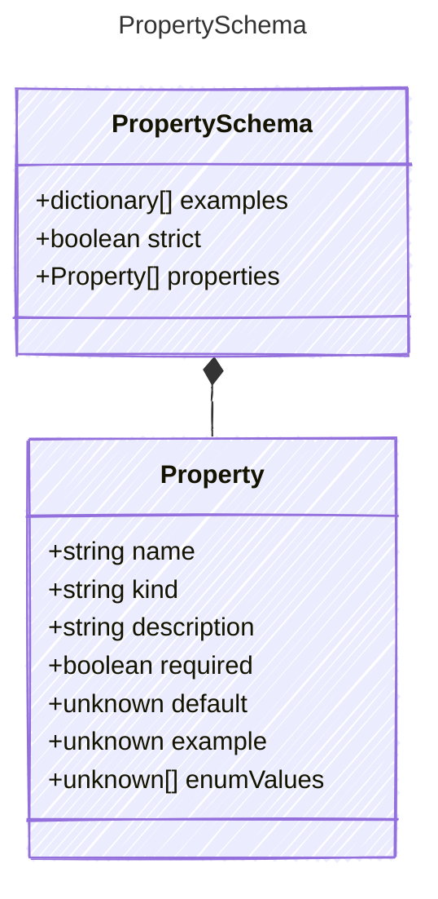

# PropertySchema

Definition for the property schema of a model.
This includes the properties and example records.

## Class Diagram



## Yaml Example

```yaml
examples:
  - key: value
strict: true
properties:
  firstName:
    kind: string
    sample: Jane
  lastName:
    kind: string
    sample: Doe
  question:
    kind: string
    sample: What is the meaning of life?

```

## Properties

| Name | Type | Description |
| ---- | ---- | ----------- |
| examples | dictionary[] | Example records for the input schema  |
| strict | boolean | Whether the input schema is strict - if true, only the defined properties are allowed  |
| properties | [Property[]](Property.md) | The input properties for the schema (Related Types: [ArrayProperty](ArrayProperty.md), [ObjectProperty](ObjectProperty.md)) |

## Composed Types

The following types are composed within `PropertySchema`:

- [Property](Property.md)
