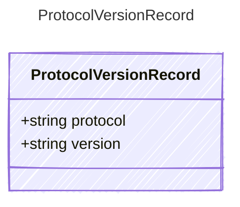

# ProtocolVersionRecord

## Class Diagram



## Yaml Example

```yaml
protocol: responses
version: v0.1.1

```

## Properties

| Name | Type | Description |
| ---- | ---- | ----------- |
| protocol | string | The protocol type.  |
| version | string | The version string for the protocol, e.g. &#39;v0.1.1&#39;.  |
