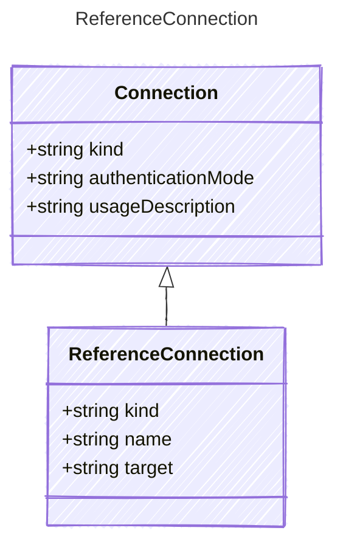

# ReferenceConnection

Connection configuration for AI services using named connections.

## Class Diagram



## Yaml Example

```yaml
kind: reference
name: my-reference-connection
target: my-target-resource

```

## Properties

| Name | Type | Description |
| ---- | ---- | ----------- |
| kind | string | The Authentication kind for the AI service (e.g., &#39;key&#39; for API key, &#39;oauth&#39; for OAuth tokens)  |
| name | string | The name of the connection  |
| target | string | The target resource or service that this connection refers to  |
