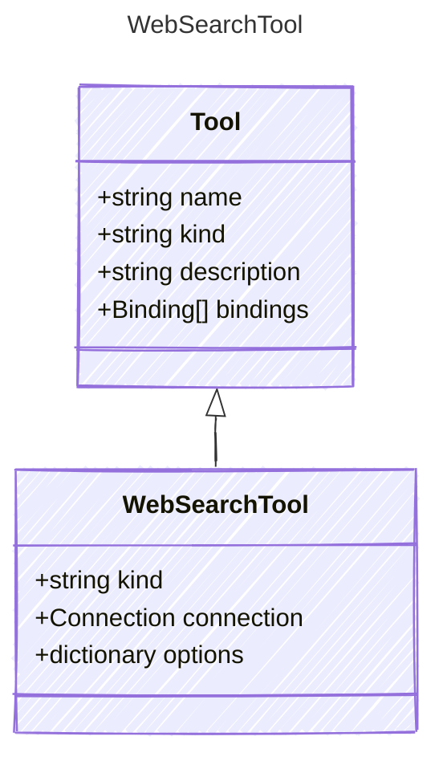

# WebSearchTool

The Bing search tool.

## Class Diagram



## Yaml Example

```yaml
kind: bing_search
connection:
  kind: reference
options:
  instanceName: MyBingInstance
  market: en-US
  setLang: en
  count: 10
  freshness: Day

```

## Properties

| Name | Type | Description |
| ---- | ---- | ----------- |
| kind | string | The kind identifier for Bing search tools  |
| connection | [Connection](Connection.md) | The connection configuration for the Bing search tool  |
| options | dictionary | The configuration options for the Bing search tool  |
