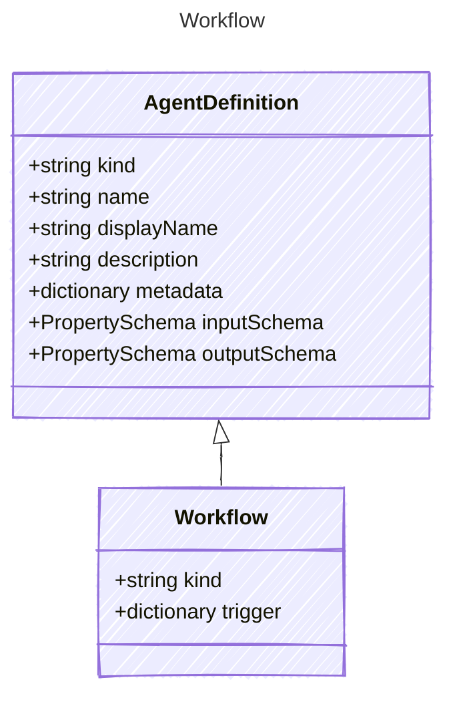

# Workflow

A workflow agent that can orchestrate multiple steps and actions.
This agent type is designed to handle complex workflows that may involve
multiple tools, models, and decision points.

The workflow agent can be configured with a series of steps that define
the flow of execution, including conditional logic and parallel processing.
This allows for the creation of sophisticated AI-driven processes that can
adapt to various scenarios and requirements.

Note: The detailed structure of the workflow steps and actions is not defined here
and would need to be implemented based on specific use cases and requirements.

## Class Diagram



## Yaml Example

```yaml
kind: workflow

```

## Properties

| Name | Type | Description |
| ---- | ---- | ----------- |
| kind | string | Type of agent, e.g., &#39;workflow&#39;  |
| trigger | dictionary | The steps that make up the workflow  |
