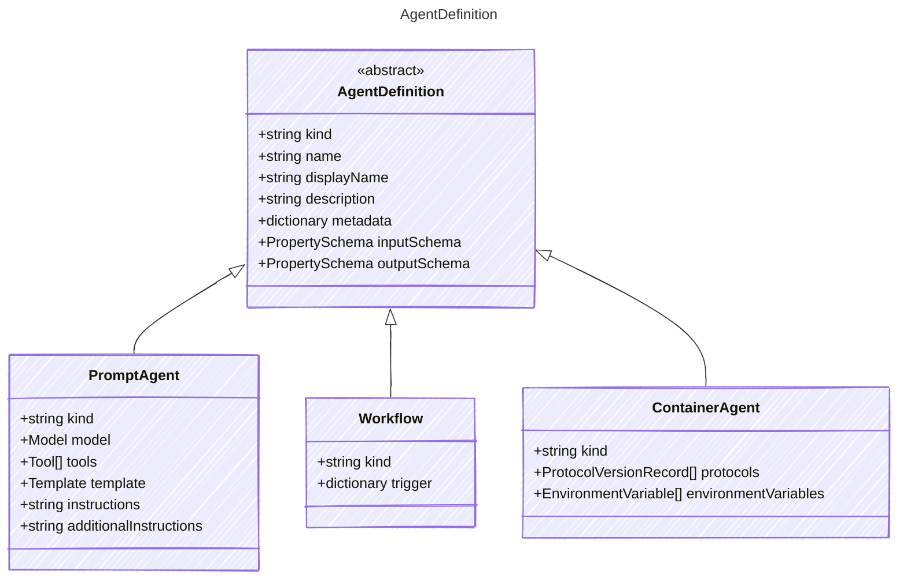

The following is a specification for defining AI agents with structured metadata, inputs, outputs, tools, and templates.
It provides a way to create reusable and composable AI agents that can be executed with specific configurations.
The specification includes metadata about the agent, model configuration, input parameters, expected outputs,
available tools, and template configurations for prompt rendering.

## Class Diagram




## Yaml Example

```yaml
kind: prompt
name: basic-prompt
displayName: Basic Prompt Agent
description: A basic prompt that uses the GPT-3 chat API to answer questions
metadata:
  authors:
    - sethjuarez
    - jietong
  tags:
    - example
    - prompt
inputSchema:
  properties:
    firstName:
      kind: string
      value: Jane
    lastName:
      kind: string
      value: Doe
    question:
      kind: string
      value: What is the meaning of life?
outputSchema:
  properties:
    answer:
      kind: string
      description: The answer to the user's question.

```


## Properties

| Name | Type | Description |
| ---- | ---- | ----------- |
| kind | string | Kind represented by the document  |
| name | string | Human-readable name of the agent  |
| displayName | string | Display name of the agent for UI purposes  |
| description | string | Description of the agent&#39;s capabilities and purpose  |
| metadata | dictionary | Additional metadata including authors, tags, and other arbitrary properties  |
| inputSchema | [PropertySchema](../propertyschema/) | Input parameters that participate in template rendering  |
| outputSchema | [PropertySchema](../propertyschema/) | Expected output format and structure from the agent  |


## Child Types

The following types extend `AgentDefinition`:

- [PromptAgent](../promptagent/)
- [Workflow](../workflow/)
- [ContainerAgent](../containeragent/)


