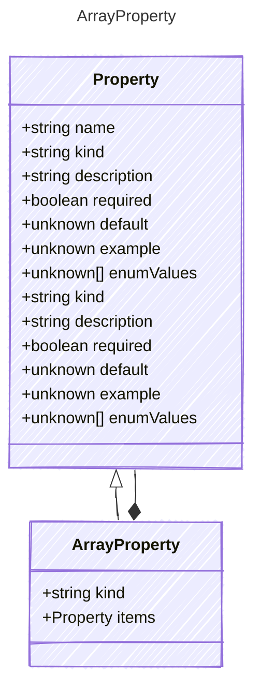

Represents an array property.
This extends the base Property model to represent an array of items.

## Class Diagram




## Yaml Example

```yaml
items:
  kind: string

```


## Properties

| Name | Type | Description |
| ---- | ---- | ----------- |
| kind | string |   |
| items | [Property](Property.md) | The type of items contained in the array (Related Types: [ObjectProperty](ObjectProperty.md)) |


## Composed Types
The following types are composed within `ArrayProperty`:

- [Property](/reference/property)


