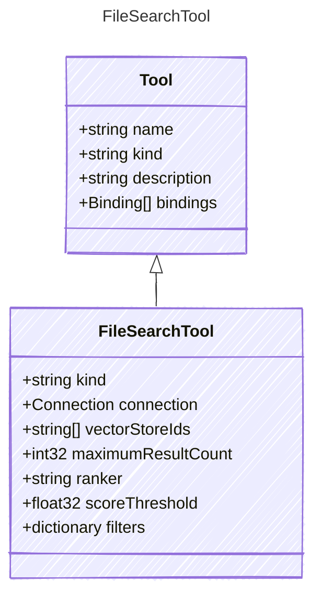

A tool for searching files.
This tool allows an AI agent to search for files based on a query.

## Class Diagram




## Yaml Example

```yaml
kind: file_search
connection:
  kind: reference
vectorStoreIds:
  - vectorStore1
  - vectorStore2
maximumResultCount: 10
ranker: auto
scoreThreshold: 0.5
filters:
  fileType: pdf
  createdAfter: 2023-01-01

```


## Properties

| Name | Type | Description |
| ---- | ---- | ----------- |
| kind | string | The kind identifier for file search tools  |
| connection | [Connection](Connection.md) | The connection configuration for the file search tool  |
| vectorStoreIds | string[] | The IDs of the vector stores to search within.  |
| maximumResultCount | int32 | The maximum number of search results to return.  |
| ranker | string | File search ranker.  |
| scoreThreshold | float32 | Ranker search threshold.  |
| filters | dictionary | Additional filters to apply during the file search.  |


