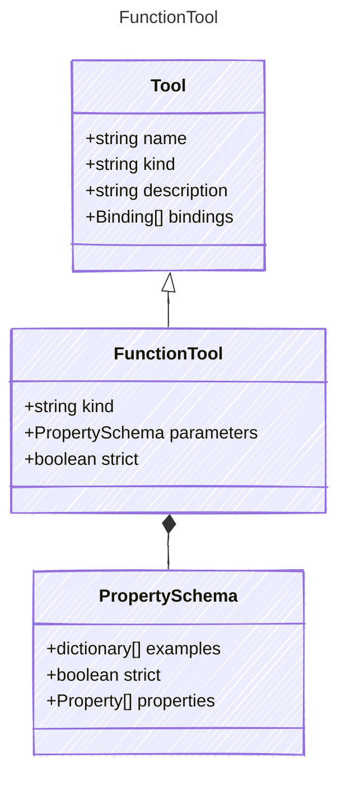

Represents a local function tool.

## Class Diagram




## Yaml Example

```yaml
kind: function
parameters:
  properties:
    firstName:
      kind: string
      value: Jane
    lastName:
      kind: string
      value: Doe
    question:
      kind: string
      value: What is the meaning of life?
strict: true

```


## Properties

| Name | Type | Description |
| ---- | ---- | ----------- |
| kind | string | The kind identifier for function tools  |
| parameters | [PropertySchema](PropertySchema.md) | Parameters accepted by the function tool  |
| strict | boolean | Indicates whether the function tool enforces strict validation on its parameters  |


## Composed Types
The following types are composed within `FunctionTool`:

- [PropertySchema](/reference/propertyschema)


