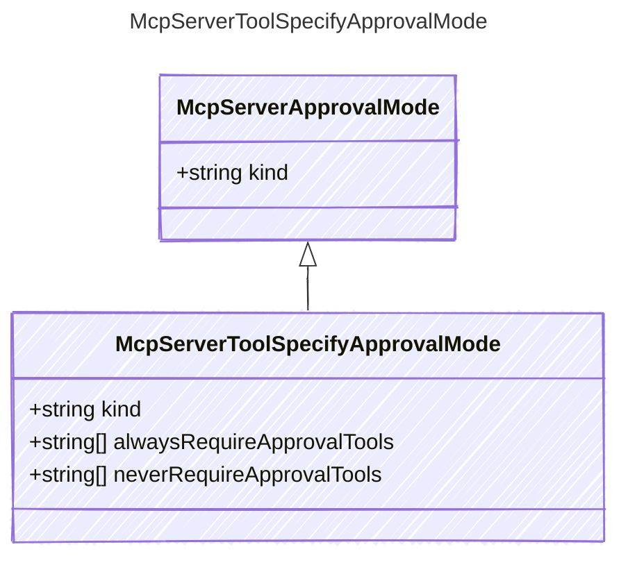

## Class Diagram




## Yaml Example

```yaml
kind: specify
alwaysRequireApprovalTools:
  - operation1
neverRequireApprovalTools:
  - operation2

```


## Properties

| Name | Type | Description |
| ---- | ---- | ----------- |
| kind | string | The kind identifier for specify approval mode  |
| alwaysRequireApprovalTools | string[] | List of tools that always require approval  |
| neverRequireApprovalTools | string[] | List of tools that never require approval  |


