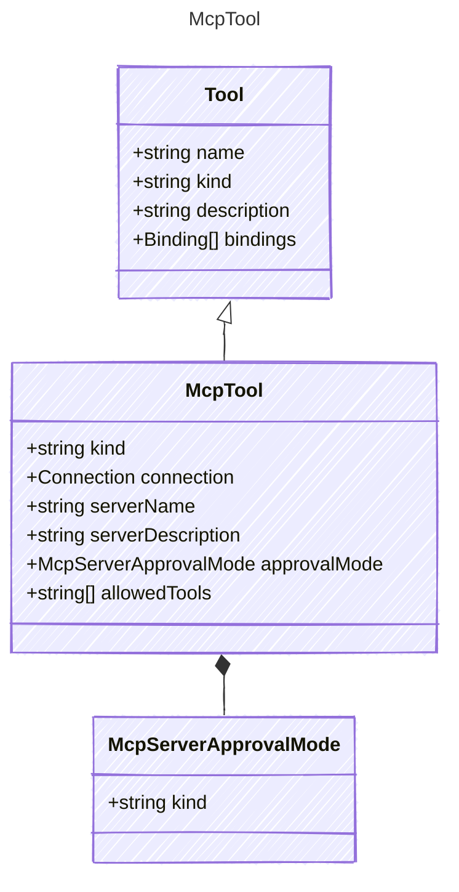

The MCP Server tool.

## Class Diagram




## Yaml Example

```yaml
kind: mcp
connection:
  kind: reference
serverName: My MCP Server
serverDescription: This tool allows access to MCP services.
approvalMode:
  kind: always
allowedTools:
  - operation1
  - operation2

```


## Properties

| Name | Type | Description |
| ---- | ---- | ----------- |
| kind | string | The kind identifier for MCP tools  |
| connection | [Connection](Connection.md) | The connection configuration for the MCP tool  |
| serverName | string | The server name of the MCP tool  |
| serverDescription | string | The description of the MCP tool  |
| approvalMode | [McpServerApprovalMode](McpServerApprovalMode.md) | The approval mode for the MCP tool, either &#39;auto&#39; or &#39;manual&#39; (Related Types: [McpServerToolAlwaysRequireApprovalMode](McpServerToolAlwaysRequireApprovalMode.md), [McpServerToolNeverRequireApprovalMode](McpServerToolNeverRequireApprovalMode.md), [McpServerToolSpecifyApprovalMode](McpServerToolSpecifyApprovalMode.md)) |
| allowedTools | string[] | List of allowed operations or resources for the MCP tool  |


## Composed Types
The following types are composed within `McpTool`:

- [McpServerApprovalMode](/reference/mcpserverapprovalmode)


