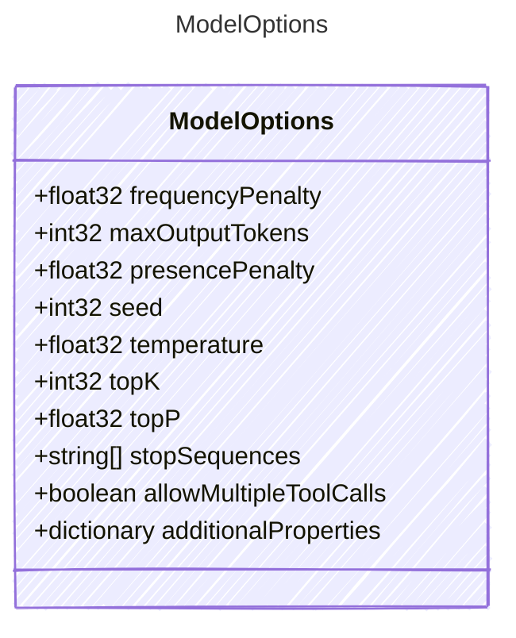

Options for configuring the behavior of the AI model.
`kind` is a required property here, but this section can accept additional via options.

## Class Diagram




## Yaml Example

```yaml
frequencyPenalty: 0.5
maxOutputTokens: 2048
presencePenalty: 0.3
seed: 42
temperature: 0.7
topK: 40
topP: 0.9
stopSequences:
  - |+
    
  - "###"
allowMultipleToolCalls: true
additionalProperties:
  customProperty: value
  anotherProperty: anotherValue

```


## Properties

| Name | Type | Description |
| ---- | ---- | ----------- |
| frequencyPenalty | float32 | The frequency penalty to apply to the model&#39;s output  |
| maxOutputTokens | int32 | The maximum number of tokens to generate in the output  |
| presencePenalty | float32 | The presence penalty to apply to the model&#39;s output  |
| seed | int32 | A random seed for deterministic output  |
| temperature | float32 | The temperature to use for sampling  |
| topK | int32 | The top-K sampling value  |
| topP | float32 | The top-P sampling value  |
| stopSequences | string[] | Stop sequences to end generation  |
| allowMultipleToolCalls | boolean | Whether to allow multiple tool calls in a single response  |
| additionalProperties | dictionary | Additional custom properties for model options  |


