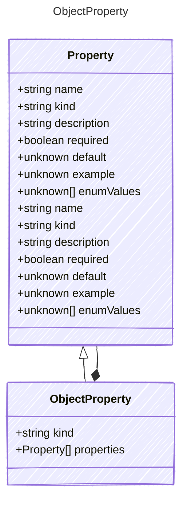

Represents an object property.
This extends the base Property model to represent a structured object.

## Class Diagram




## Yaml Example

```yaml
properties:
  property1:
    kind: string
  property2:
    kind: number

```


## Properties

| Name | Type | Description |
| ---- | ---- | ----------- |
| kind | string |   |
| properties | [Property[]](Property.md) | The properties contained in the object  |


## Composed Types
The following types are composed within `ObjectProperty`:

- [Property](/reference/property)


