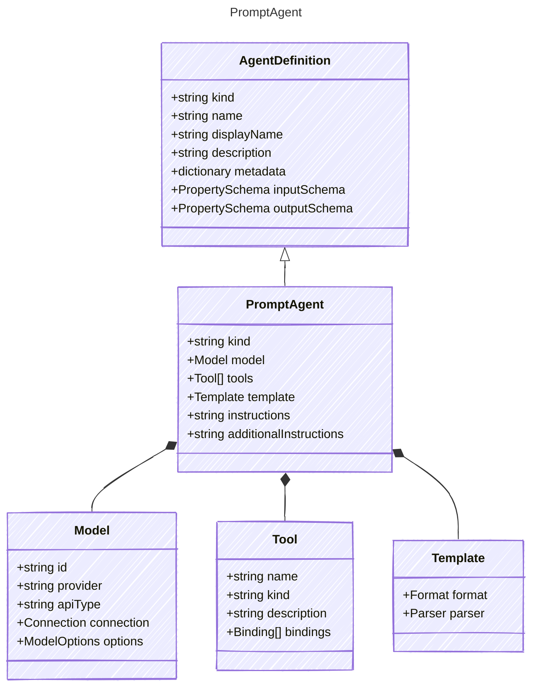

Prompt based agent definition. Used to create agents that can be executed directly.
These agents can leverage tools, input parameters, and templates to generate responses.
They are designed to be straightforward and easy to use for various applications.

## Class Diagram



## Markdown Example

```markdown
---
kind: prompt
model:
  id: gpt-35-turbo
  connection:
    kind: key
    endpoint: https://{your-custom-endpoint}.openai.azure.com/
    key: "{your-api-key}"
tools:
  - name: getCurrentWeather
    kind: function
    description: Get the current weather in a given location
    parameters:
      location:
        kind: string
        description: The city and state, e.g. San Francisco, CA
      unit:
        kind: string
        description: The unit of temperature, e.g. Celsius or Fahrenheit
template:
  format: mustache
  parser: prompty
---
system:
You are an AI assistant who helps people find information.
As the assistant, you answer questions briefly, succinctly,
and in a personable manner using markdown and even add some 
personal flair with appropriate emojis.

# Customer
You are helping {{firstName}} {{lastName}} to find answers to 
their questions. Use their name to address them in your responses.
user:
{{question}}
```


## Yaml Example

```yaml
kind: prompt
model:
  id: gpt-35-turbo
  connection:
    kind: key
    endpoint: https://{your-custom-endpoint}.openai.azure.com/
    key: "{your-api-key}"
tools:
  - name: getCurrentWeather
    kind: function
    description: Get the current weather in a given location
    parameters:
      location:
        kind: string
        description: The city and state, e.g. San Francisco, CA
      unit:
        kind: string
        description: The unit of temperature, e.g. Celsius or Fahrenheit
template:
  format: mustache
  parser: prompty
instructions: |-
  system:
  You are an AI assistant who helps people find information.
  As the assistant, you answer questions briefly, succinctly,
  and in a personable manner using markdown and even add some 
  personal flair with appropriate emojis.

  # Customer
  You are helping {{firstName}} {{lastName}} to find answers to 
  their questions. Use their name to address them in your responses.
  user:
  {{question}}

```


## Properties

| Name | Type | Description |
| ---- | ---- | ----------- |
| kind | string | Type of agent, e.g., &#39;prompt&#39;  |
| model | [Model](../model/) | Primary AI model configuration for the agent  |
| tools | [Tool[]](../tool/) | Tools available to the agent for extended functionality (Related Types: [FunctionTool](../functiontool/), [CustomTool](../customtool/), [WebSearchTool](../websearchtool/), [FileSearchTool](../filesearchtool/), [McpTool](../mcptool/), [OpenApiTool](../openapitool/), [CodeInterpreterTool](../codeinterpretertool/)) |
| template | [Template](../template/) | Template configuration for prompt rendering  |
| instructions | string | Give your agent clear directions on what to do and how to do it. Include specific tasks, their order, and any special instructions like tone or engagement style. (can use this for a pure yaml declaration or as content in the markdown format)  |
| additionalInstructions | string | Additional instructions or context for the agent, can be used to provide extra guidance (can use this for a pure yaml declaration)  |


## Composed Types
The following types are composed within `PromptAgent`:

- [Model](../model/)
- [Tool](../tool/)
- [Template](../template/)


