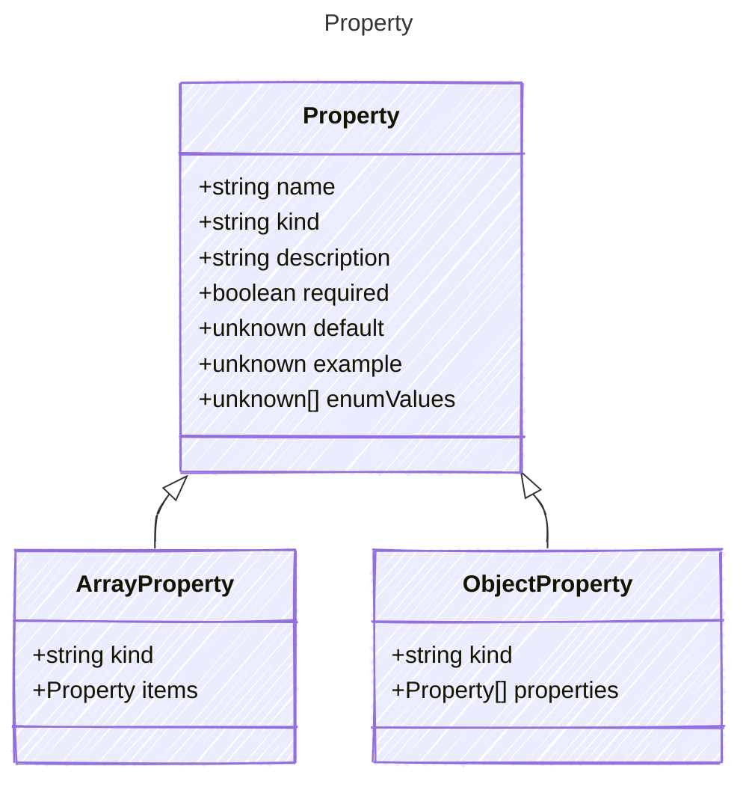

Represents a single property
* This model defines the structure of properties that can be used in prompts,
including their type, description, whether they are required, and other attributes.
* It allows for the definition of dynamic inputs that can be filled with data
and processed to generate prompts for AI models.

## Class Diagram




## Yaml Example

```yaml
name: my-input
kind: string
description: A description of the input property
required: true
default: default value
example: example value
enumValues:
  - value1
  - value2
  - value3

```


## Properties

| Name | Type | Description |
| ---- | ---- | ----------- |
| name | string | Name of the property  |
| kind | string | The data type of the input property  |
| description | string | A short description of the input property  |
| required | boolean | Whether the property is required  |
| default | unknown | The default value of the property - this represents the default value if none is provided  |
| example | unknown | Example value used for either initialization or tooling  |
| enumValues | unknown[] | Allowed enumeration values for the property  |


## Child Types

The following types extend `Property`:

- [ArrayProperty](/reference/arrayproperty)
- [ObjectProperty](/reference/objectproperty)


## Alternate Constructions

The following alternate constructions are available for `Property`. 
These allow for simplified creation of instances using a single property.

### boolean input
Simple construction with just a kind of boolean

The following simplified representation can be used:
```yaml
input: true

```
This is equivalent to the full representation:
```yaml
input:
  kind: boolean
  example: true

```
### float32 input
Simple construction with just a kind of float

The following simplified representation can be used:
```yaml
input: 3.14

```
This is equivalent to the full representation:
```yaml
input:
  kind: float
  example: 3.14

```
### integer input
Simple construction with just a kind of integer

The following simplified representation can be used:
```yaml
input: 5

```
This is equivalent to the full representation:
```yaml
input:
  kind: integer
  example: 5

```
### string input
Simple construction with just a kind of string

The following simplified representation can be used:
```yaml
input: "example"

```
This is equivalent to the full representation:
```yaml
input:
  kind: string
  example: "example"

```
