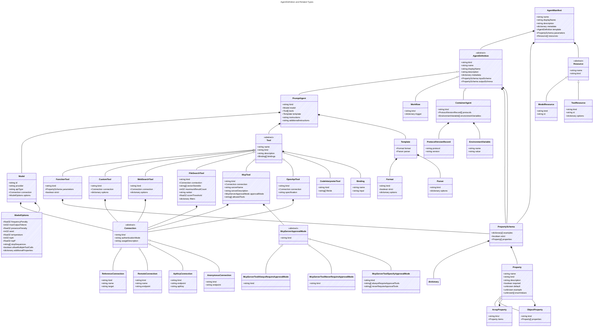

The following diagram illustrates the classes and their relationships for declarative agents.
The root [object](agentdefinition/) represents the main entry point for the system.

```mermaid
---
title: AgentDefinition and Related Types
config:
  look: handDrawn
  theme: colorful
  class:
    hideEmptyMembersBox: true
---
classDiagram
    class AgentDefinition {
      <<abstract>>
        +string kind
        +string name
        +string displayName
        +string description
        +dictionary metadata
        +PropertySchema inputSchema
        +PropertySchema outputSchema
    }
    class Connection {
      <<abstract>>
        +string kind
        +string authenticationMode
        +string usageDescription
    }
    class ReferenceConnection {
      
        +string kind
        +string name
        +string target
    }
    class RemoteConnection {
      
        +string kind
        +string name
        +string endpoint
    }
    class ApiKeyConnection {
      
        +string kind
        +string endpoint
        +string apiKey
    }
    class AnonymousConnection {
      
        +string kind
        +string endpoint
    }
    class ModelOptions {
      
        +float32 frequencyPenalty
        +int32 maxOutputTokens
        +float32 presencePenalty
        +int32 seed
        +float32 temperature
        +int32 topK
        +float32 topP
        +string[] stopSequences
        +boolean allowMultipleToolCalls
        +dictionary additionalProperties
    }
    class Model {
      
        +string id
        +string provider
        +string apiType
        +Connection connection
        +ModelOptions options
    }
    class Binding {
      
        +string name
        +string input
    }
    class Tool {
      <<abstract>>
        +string name
        +string kind
        +string description
        +Binding[] bindings
    }
    class Property {
      
        +string name
        +string kind
        +string description
        +boolean required
        +unknown default
        +unknown example
        +unknown[] enumValues
    }
    class ObjectProperty {
      
        +string kind
        +Property[] properties
    }
    class ArrayProperty {
      
        +string kind
        +Property items
    }
    class PropertySchema {
      
        +dictionary[] examples
        +boolean strict
        +Property[] properties
    }
    class FunctionTool {
      
        +string kind
        +PropertySchema parameters
        +boolean strict
    }
    class CustomTool {
      
        +string kind
        +Connection connection
        +dictionary options
    }
    class WebSearchTool {
      
        +string kind
        +Connection connection
        +dictionary options
    }
    class FileSearchTool {
      
        +string kind
        +Connection connection
        +string[] vectorStoreIds
        +int32 maximumResultCount
        +string ranker
        +float32 scoreThreshold
        +dictionary filters
    }
    class McpServerApprovalMode {
      <<abstract>>
        +string kind
    }
    class McpServerToolAlwaysRequireApprovalMode {
      
        +string kind
    }
    class McpServerToolNeverRequireApprovalMode {
      
        +string kind
    }
    class McpServerToolSpecifyApprovalMode {
      
        +string kind
        +string[] alwaysRequireApprovalTools
        +string[] neverRequireApprovalTools
    }
    class McpTool {
      
        +string kind
        +Connection connection
        +string serverName
        +string serverDescription
        +McpServerApprovalMode approvalMode
        +string[] allowedTools
    }
    class OpenApiTool {
      
        +string kind
        +Connection connection
        +string specification
    }
    class CodeInterpreterTool {
      
        +string kind
        +string[] fileIds
    }
    class Format {
      
        +string kind
        +boolean strict
        +dictionary options
    }
    class Parser {
      
        +string kind
        +dictionary options
    }
    class Template {
      
        +Format format
        +Parser parser
    }
    class PromptAgent {
      
        +string kind
        +Model model
        +Tool[] tools
        +Template template
        +string instructions
        +string additionalInstructions
    }
    class Workflow {
      
        +string kind
        +dictionary trigger
    }
    class ProtocolVersionRecord {
      
        +string protocol
        +string version
    }
    class EnvironmentVariable {
      
        +string name
        +string value
    }
    class ContainerAgent {
      
        +string kind
        +ProtocolVersionRecord[] protocols
        +EnvironmentVariable[] environmentVariables
    }
    class Resource {
      <<abstract>>
        +string name
        +string kind
    }
    class ModelResource {
      
        +string kind
        +string id
    }
    class ToolResource {
      
        +string kind
        +string id
        +dictionary options
    }
    class AgentManifest {
      
        +string name
        +string displayName
        +string description
        +dictionary metadata
        +AgentDefinition template
        +PropertySchema parameters
        +Resource[] resources
    }
    AgentDefinition <|-- PromptAgent
    AgentDefinition <|-- Workflow
    AgentDefinition <|-- ContainerAgent
    Connection <|-- ReferenceConnection
    Connection <|-- RemoteConnection
    Connection <|-- ApiKeyConnection
    Connection <|-- AnonymousConnection
    Tool <|-- FunctionTool
    Tool <|-- CustomTool
    Tool <|-- WebSearchTool
    Tool <|-- FileSearchTool
    Tool <|-- McpTool
    Tool <|-- OpenApiTool
    Tool <|-- CodeInterpreterTool
    Property <|-- ArrayProperty
    Property <|-- ObjectProperty
    McpServerApprovalMode <|-- McpServerToolAlwaysRequireApprovalMode
    McpServerApprovalMode <|-- McpServerToolNeverRequireApprovalMode
    McpServerApprovalMode <|-- McpServerToolSpecifyApprovalMode
    Resource <|-- ModelResource
    Resource <|-- ToolResource
    AgentDefinition *-- PropertySchema
    AgentDefinition *-- PropertySchema
    Model *-- Connection
    Model *-- ModelOptions
    Tool *-- Binding
    ObjectProperty *-- Property
    ArrayProperty *-- Property
    PropertySchema *-- dictionary
    PropertySchema *-- Property
    FunctionTool *-- PropertySchema
    CustomTool *-- Connection
    WebSearchTool *-- Connection
    FileSearchTool *-- Connection
    McpTool *-- Connection
    McpTool *-- McpServerApprovalMode
    OpenApiTool *-- Connection
    Template *-- Format
    Template *-- Parser
    PromptAgent *-- Model
    PromptAgent *-- Tool
    PromptAgent *-- Template
    ContainerAgent *-- ProtocolVersionRecord
    ContainerAgent *-- EnvironmentVariable
    AgentManifest *-- AgentDefinition
    AgentManifest *-- PropertySchema
    AgentManifest *-- Resource
```