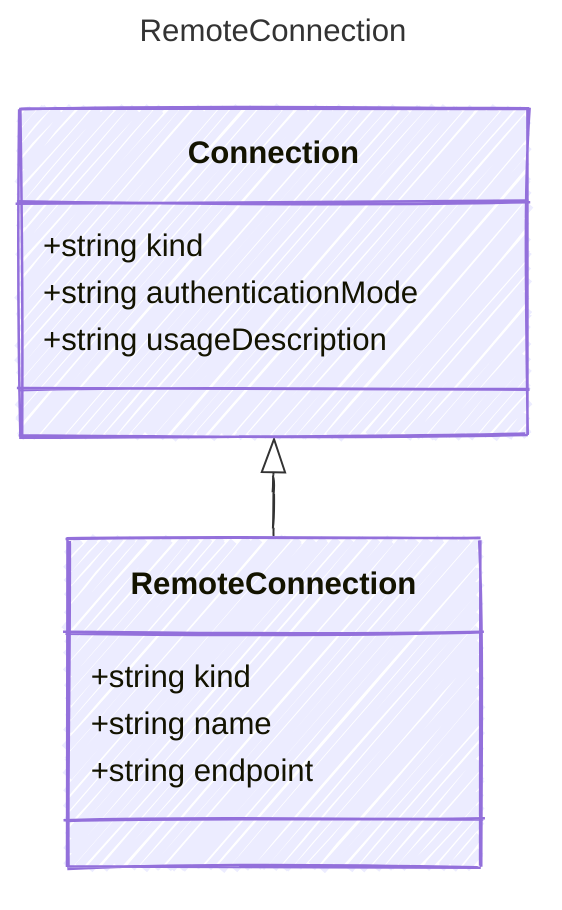

Connection configuration for AI services using named connections.

## Class Diagram




## Yaml Example

```yaml
kind: remote
name: my-reference-connection
endpoint: https://{your-custom-endpoint}.openai.azure.com/

```


## Properties

| Name | Type | Description |
| ---- | ---- | ----------- |
| kind | string | The Authentication kind for the AI service (e.g., &#39;key&#39; for API key, &#39;oauth&#39; for OAuth tokens)  |
| name | string | The name of the connection  |
| endpoint | string | The endpoint URL for the AI service  |


