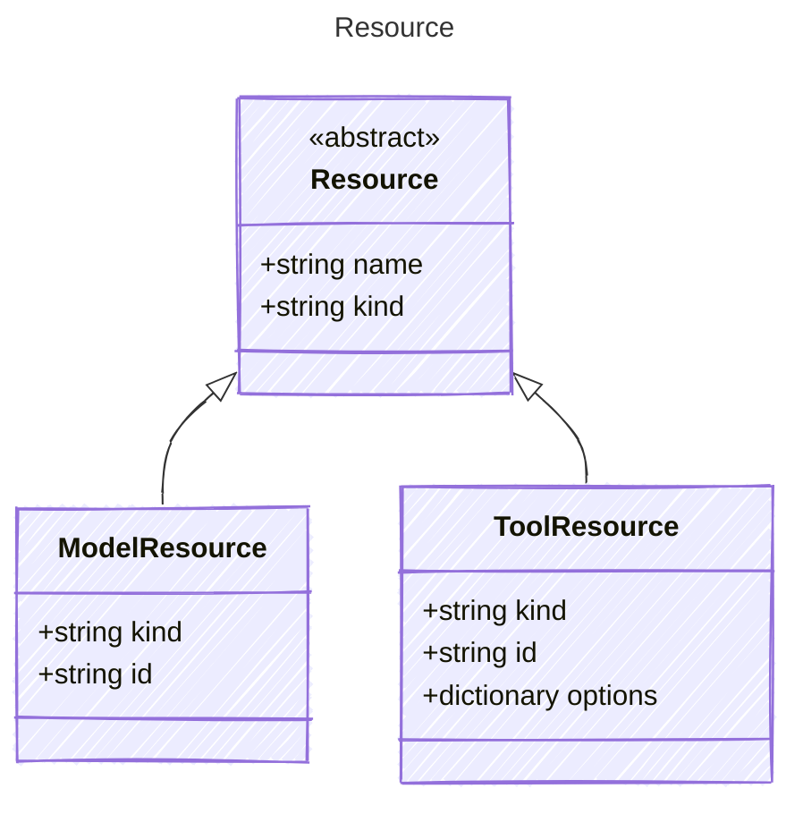

Represents a resource required by the agent
Resources can include databases, APIs, or other external systems
that the agent needs to interact with to perform its tasks

## Class Diagram




## Yaml Example

```yaml
name: my-resource
kind: model

```


## Properties

| Name | Type | Description |
| ---- | ---- | ----------- |
| name | string | Name of the resource  |
| kind | string | The kind of resource (e.g., model, tool)  |


## Child Types

The following types extend `Resource`:

- [ModelResource](/reference/modelresource)
- [ToolResource](/reference/toolresource)


