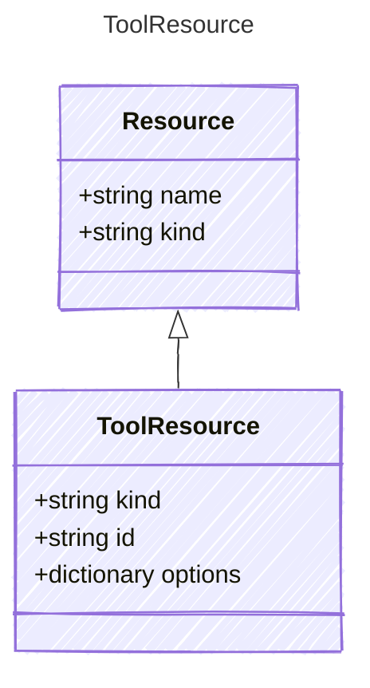

Represents a tool resource required by the agent

## Class Diagram




## Yaml Example

```yaml
kind: tool
id: web-search
options:
  myToolResourceProperty: myValue

```


## Properties

| Name | Type | Description |
| ---- | ---- | ----------- |
| kind | string | The kind identifier for tool resources  |
| id | string | The unique identifier of the tool resource  |
| options | dictionary | Configuration options for the tool resource  |


